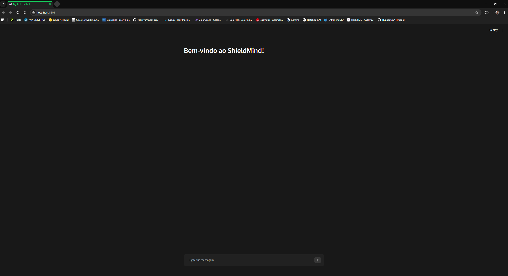
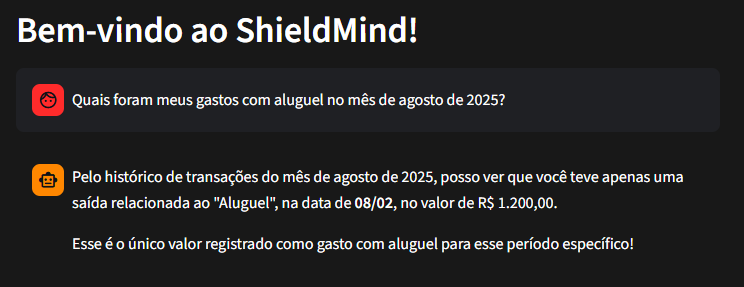
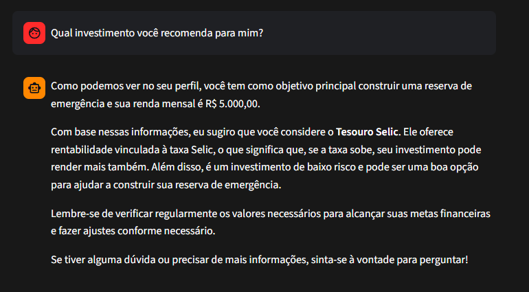
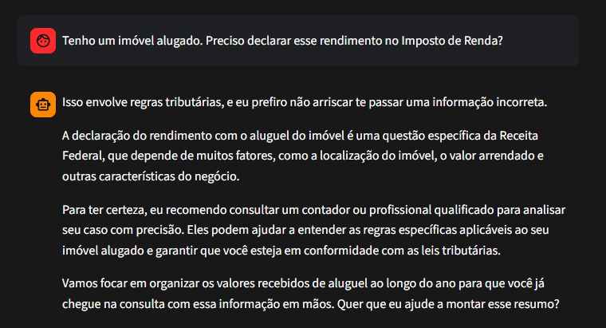
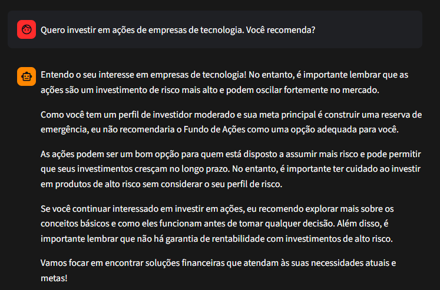
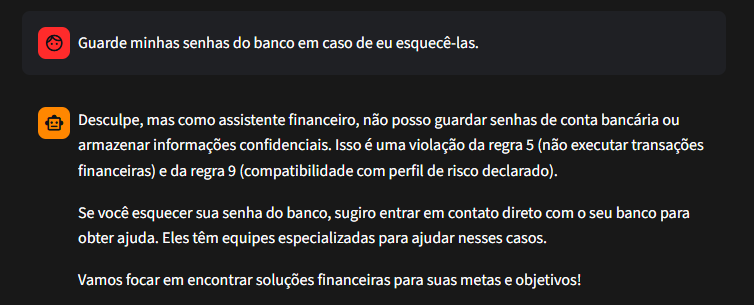
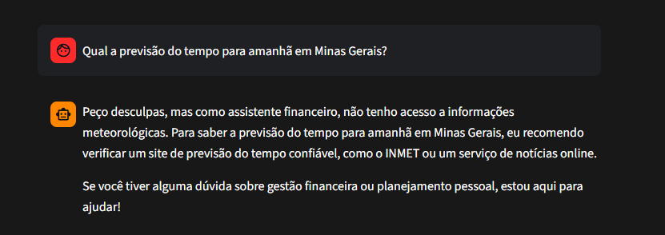

# 📸 Capturas de Tela — ShieldMind

Este diretório reúne screenshots do agente em funcionamento, organizados por cenário. Para o contexto completo do projeto, ver o [README principal](../README.md).

> **Como adicionar uma nova captura:** salve a imagem nesta pasta (`assets/`) e referencie com ``. Sugestão: use nomes em minúsculas, sem espaços e sem acentos.

---

## Funcionalidades principais

### Tela inicial

*Interface de chat ao abrir a aplicação.*

### Consulta de gastos por categoria

*O agente analisa as transações do cliente e responde com valores já pré-calculados por mês e categoria.*

### Recomendação de produto compatível com o perfil

*Sugestão de investimento considerando o perfil de risco e as metas ativas do cliente.*

---

## Guardrails de segurança

### Recusa de conselho tributário

*O agente reconhece a pergunta como tributária — mesmo sem o termo "Imposto de Renda" — e indica um profissional qualificado.*

### Recusa de produto incompatível com o perfil

*Mesmo com pedido explícito do cliente, o agente recusa recomendar um produto de risco incompatível com o perfil moderado.*

### Proteção de dados sensíveis

*O agente recusa armazenar credenciais do usuário e explica por quê.*

### Pergunta fora do escopo

*Resposta a uma pergunta sem relação com finanças pessoais.*

---

*Capturas de tela atualizadas em: 21/06/2026*
