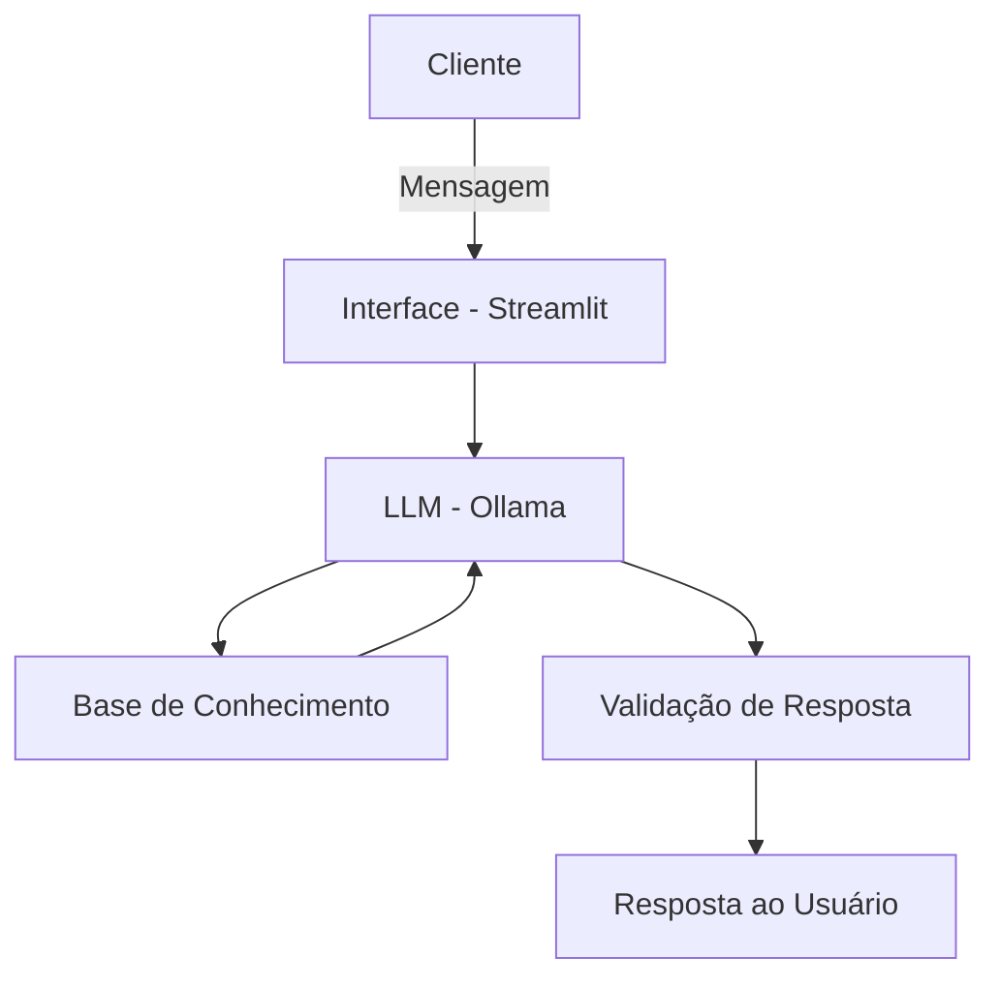

# Documentação do Agente

## Caso de Uso

### Problema

> Qual problema financeiro seu agente resolve?

Grande parte das pessoas tem dificuldade em organizar suas finanças pessoais, acompanhar seus gastos e tomar decisões de investimento adequadas ao seu perfil e objetivos. A falta de orientação personalizada e acessível faz com que muitas pessoas não consigam construir patrimônio, montar reserva de emergência ou planejar metas de médio e longo prazo.

### Solução

> Como o agente resolve esse problema de forma proativa?

O agente atua como um assistente de planejamento financeiro pessoal, analisando o perfil do investidor, o histórico de transações e os produtos financeiros disponíveis para oferecer orientações personalizadas. Ele acompanha o progresso das metas financeiras, sugere produtos adequados ao perfil e objetivos do usuário e responde dúvidas sobre investimentos, gastos e organização financeira.

### Público-Alvo

> Quem vai usar esse agente?

Adultos com renda estável que desejam organizar melhor suas finanças pessoais, mas não têm acesso ou não podem arcar com o custo de uma consultoria financeira profissional. O foco são pessoas com perfil de investidor de moderado a conservador, que buscam construir reserva de emergência, controlar gastos e planejar metas de médio prazo, como a compra de um imóvel.

---

## Persona e Tom de Voz

### Nome do Agente

ShieldMind

### Personalidade

> Como o agente se comporta?

- Consultivo e orientado a metas;
- Usa linguagem simples e acessível;
- Apresenta análises com base nos dados reais do usuário;
- Empático, sem causar ansiedade ou alarmismo em relação à situação financeira.

### Tom de Comunicação

> Formal, informal, técnico, acessível?

Tom informal e acolhedor, considerando que o público são pessoas sem formação financeira aprofundada. O agente evita jargões técnicos desnecessários e, quando os usa, sempre os explica de forma clara e direta.

### Exemplos de Linguagem

- Saudação: "Olá! Vamos dar uma olhada nas suas finanças hoje?"
- Confirmação: "Entendi! Um momento, já analiso isso para você."
- Erro/Limitação: "Não tenho informações suficientes para responder isso, mas posso ajudar com..."

---

## Arquitetura

### Diagrama

### Componentes

| Componente | Descrição |
|------------|-----------|
| Interface | Interface conversacional desenvolvida em Streamlit |
| LLM | Modelo de linguagem local executado via Ollama |
| Base de Conhecimento | Base de dados composta pelo perfil do investidor, histórico de transações, histórico de atendimentos e catálogo de produtos financeiros disponíveis |
| Validação | Verificação de coerência das respostas e limitação do escopo ao contexto de planejamento financeiro pessoal |

---

## Segurança e Anti-Alucinação

### Estratégias Adotadas

- [x] O agente responde apenas com base na base de conhecimento previamente estruturada
- [x] As sugestões de produtos são baseadas no perfil, nas metas e no histórico real do usuário
- [x] O agente informa quando não possui informação suficiente para responder
- [x] As respostas possuem caráter exclusivamente educacional e orientativo
- [x] O agente evita gerar informações fora do contexto de planejamento financeiro pessoal

### Limitações Declaradas

> O que o agente NÃO faz?

- [x] Não substitui consultores financeiros certificados, contadores ou advogados
- [x] Não executa transações financeiras em nome do usuário
- [x] Não garante rentabilidade ou retorno de nenhum produto financeiro
- [x] Não acessa dados bancários em tempo real ou realiza integrações com instituições financeiras
- [x] Não fornece aconselhamento jurídico ou tributário
- [x] Não atua como gestor de investimentos
- [x] Não aprende automaticamente com conversas dos usuários
- [x] Pode apresentar sugestões limitadas caso o perfil ou as transações do usuário estejam desatualizados na base de conhecimento
- [x] Pode apresentar respostas limitadas caso a pergunta esteja fora do escopo de planejamento financeiro pessoal