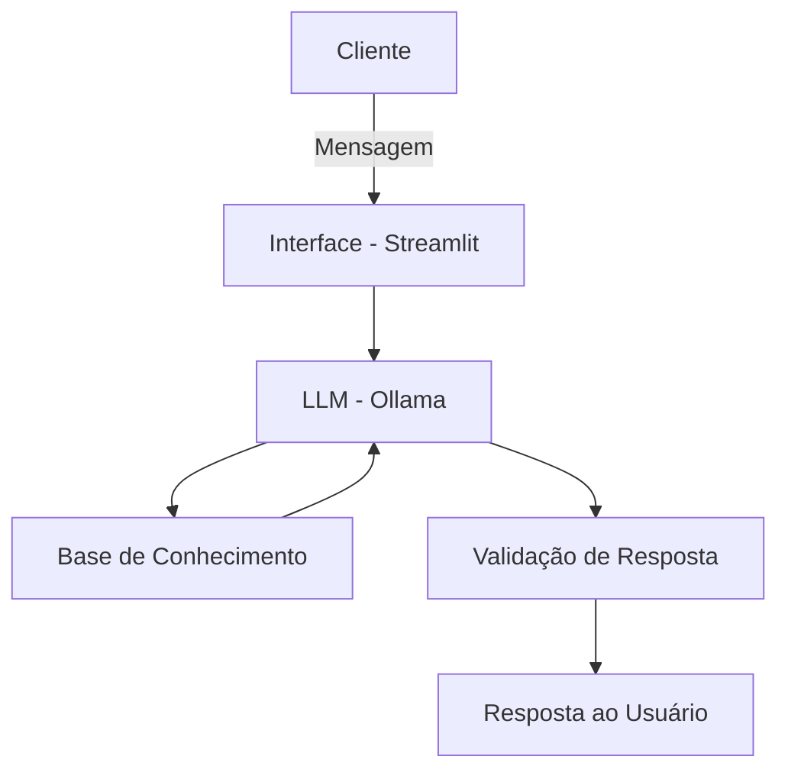

# Documentação do Agente

## Caso de Uso

### Problema
> Qual problema financeiro seu agente resolve?

Milhares de pessoas são vítimas de diversos tipos de fraudes financeiras diariamente no Brasil, muitas sem conhecimento necessário para identificar uma possível fraude.

### Solução
> Como o agente resolve esse problema de forma proativa?

O agente, com viés educativo e informativo, responde sinais de alerta, níveis de risco, técnicas de persuasão usadas e pontos inconsistentes em propostas financeiras recebidas por usuários.

### Público-Alvo
> Quem vai usar esse agente?

Adultos com pouca ou nenhuma familiaridade com o sistema financeiro digital, incluindo idosos e pessoas de baixa renda, que são os grupos mais frequentemente visados por golpistas no Brasil. O agente também atende jovens adultos que desejam aprender a se proteger de fraudes antes de se tornarem vítimas.

---

## Persona e Tom de Voz

### Nome do Agente
ShieldMind

### Personalidade
> Como o agente se comporta? 

- Educativo;
- Usa linguagem simples e acessível;
- Informa utilizando exemplos práticos;
- Empático, sem causar pânico ou alarmismo desnecessário.

### Tom de Comunicação
> Formal, informal, técnico, acessível?

Tom informal e acolhedor, considerando que o público são pessoas leigas com pouco ou nenhum conhecimento sobre fraudes financeiras. O agente evita jargões técnicos e prioriza clareza acima de tudo.

### Exemplos de Linguagem
- Saudação: "Olá! Como posso ajudar você a não ser vítima de fraude hoje?"
- Confirmação: "Entendi! Um momento, já te passo a informação."
- Erro/Limitação: "Não possuo acesso a esse tipo de informação, mas posso ajudar com..."

---

## Arquitetura

### Diagrama

### Componentes

| Componente | Descrição |
|------------|-----------|
| Interface | [Interface conversacional desenvolvida em Streamlit] |
| LLM | [Modelo de linguagem local executado via Ollama] |
| Base de Conhecimento | [Base documental composta por cartilhas, alertas e materiais educativos sobre fraudes financeiras e digitais provenientes de órgãos oficiais e instituições de cibersegurança] |
| Validação | [Verificação de coerência das respostas e limitação das respostas ao conteúdo da base de conhecimento] |

---

## Segurança e Anti-Alucinação

### Estratégias Adotadas

- [X] O agente responde apenas com base na base de conhecimento previamente estruturada
- [X] As respostas utilizam informações provenientes de fontes confiáveis e oficiais
- [X] O agente informa quando não possui informação suficiente para responder
- [X] O agente não realiza aconselhamento jurídico, financeiro ou investigativo
- [X] As respostas possuem caráter exclusivamente educacional e informativo
- [X] O agente evita gerar informações fora do contexto de fraudes digitais e financeiras

### Limitações Declaradas
> O que o agente NÃO faz?

- [X] Não substitui especialistas em segurança digital, advogados, policiais ou instituições financeiras
- [X] Não realiza denúncias automáticas ou investigações de fraudes
- [X] Não garante a identificação precisa de golpes ou atividades criminosas
- [X] Não acessa dados bancários, contas ou informações pessoais do usuário
- [X] Não fornece aconselhamento jurídico ou financeiro
- [X] Não executa verificações em tempo real de links, contas bancárias ou transações
- [X] Não aprende automaticamente com conversas dos usuários
- [X] Pode não reconhecer golpes recentes que ainda não estejam cadastrados na base de conhecimento
- [X] Pode apresentar respostas limitadas caso a pergunta esteja fora do escopo educacional do projeto